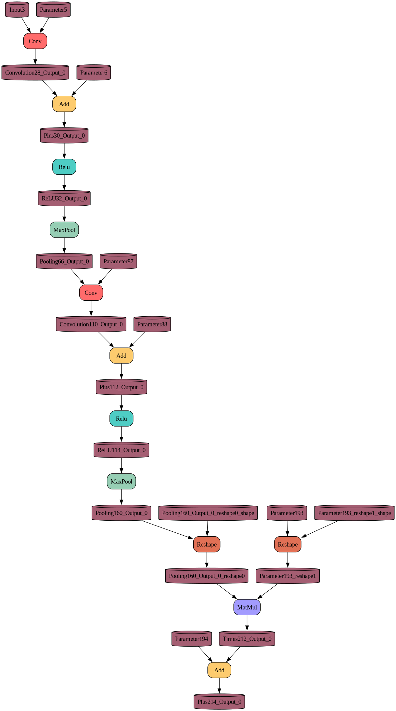

# BEBRA TENSOR COMPILER

### Installation

maybe you'll need this

```bash
sudo apt install protobuf-compiler libprotobuf-dev
```

```bash
chmod +x ./init.sh
./init.sh
```

#### Running tests
- Tests are written in `tests` directory.
- Run them using `ctest --output-on-failure` in `cmake` dir.

#### Project structure
Project consists of `Core` and `Ops` parts.

### CORE

The core part consists of `BebraGraph`, `BebraNode`, `BebraTensor`, etc. Model graph consists of tensors and nodes, which are somehow connected through inputs, outputs.

> Each node has op_type. e.g : `Conv`, `Gemm`, `Add`. Some of them have attributes (simpler: constant values)

The specification of operators can be seen [here](https://onnx.ai/onnx/operators/index.html).

### OPS

Op part code is generated using `ruby` and `ops.yaml`.
This approach is good because it is easier to add and delete new instructions.

To generate code -> go to `include/bebra/ops`.

run this

```
ruby ops_gen.rb
```

you can also add your instructions, now I have only 7 of them.

### GRAPHVIZ


This is a graph for MNIST-8 Neural Network.
To generate graphs for your Neural Networks use `--dump <filename>` syntax when running a program. Then use `python3 dot2png.py` to generate `.png`

##### Usecase for generating dump
```bash
./cmake/bebra_tensor --dump third_party/mnist-8.onnx

python3 dot2png.py
? Choose a .dot file you want to generate .png from (Use arrow keys)
 » dot/mnist-8.dot

```

-----

#### Future plans

| Task | Stage |
|------|-------|
| Implement static polimorphism. | maybe


